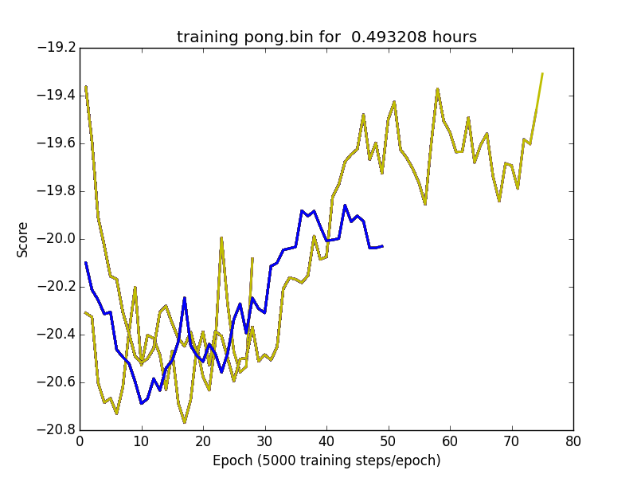

fast-dqn-caffe
==
An optimized C++ Deep Q-Network (DQN) implementation for Caffe.

The goal is to provide a fast version of DQN that works with relatively little setup.  Where possible, reproducing Deepmind's results is desirable, especially for making comparisons. Still the priority is on speed, since speed is a substantial barrier to the use of reenforcement learning for practical applications.

Original code by [muupan/dqn-in-the-caffe](https://github.com/muupan/dqn-in-the-caffe) with cherry picking from 
[mhauskn/dqn/recurrent](https://github.com/mhauskn/dqn/tree/recurrent)

##Requirements:


- Caffe, **commit: ff16f6e43dd718921e5203f640dd57c68f01cdb3**
- Arcade Learning Environment **with the patch below**
- Ubuntu is the only version tested so far

Note:
**fast_dqn** doesn't work with the current head of caffe/master since
something changed since September 2015 that blows up the net during training.  Let me know if you find the problem, or if the current code works for you.

To date **fast_dqn** has only been tested on ubuntu 15.10.

The GPU is turned on and has been tested with cudnn v3
and CU toolkit v7.5.


###Required ALE patch to help speed things up.

The ALE folks are working on adding to the C++ API the same method to convert images to grayscale that is in Python.  They haven't decided on a final version of the PR yet so we use our own patch for now.

```
diff --git a/src/ale_interface.cpp b/src/ale_interface.cpp
index 5f7f796..058ee86 100644
--- a/src/ale_interface.cpp
+++ b/src/ale_interface.cpp
@@ -254,13 +254,14 @@ const ALEScreen& ALEInterface::getScreen() {
 //This method should receive an array of length width x height
 //(generally 160 x 210 = 33,600) and then it will fill this array
 //with the grayscale colours
-void ALEInterface::getScreenGrayscale(pixel_t *grayscale_output_buffer){
+void ALEInterface::getScreenGrayscale(std::vector<pixel_t>& grayscale_output_buffer){
   size_t w = environment->getScreen().width();
   size_t h = environment->getScreen().height();
   size_t screen_size = w*h;
+  assert(grayscale_output_buffer.size() >= screen_size);
   pixel_t *ale_screen_data = environment->getScreen().getArray();
 
-  theOSystem->colourPalette().applyPaletteGrayscale(grayscale_output_buffer, ale_screen_data, screen_size);
+  theOSystem->colourPalette().applyPaletteGrayscale(&grayscale_output_buffer[0], ale_screen_data, screen_size);
 }
 
 //This method should receive an array of length 3 x width x height
diff --git a/src/ale_interface.hpp b/src/ale_interface.hpp
index 5f807a2..0cedb65 100644
--- a/src/ale_interface.hpp
+++ b/src/ale_interface.hpp
@@ -110,7 +110,7 @@ public:
   //This method should receive an array of length width x height
   //(generally 160 x 210 = 33,600) and then it will fill this array
   //with the grayscale colours
-  void getScreenGrayscale(pixel_t *grayscale_output_buffer);
+  void getScreenGrayscale(std::vector<pixel_t>& grayscale_output_buffer);
 
   //This method should receive an array of length 3 x width x height
   //(generally 3 x 160 x 210 = 100,800) and then it will fill this
```


##To build:
```
mkdir build
cd build
cmake ..
make
cd ..
```


##To run:
- Besure you're only running ALE **supported** roms otherwise ALE will crash.
- You should also have a version of pong.bin to validate the build.

- Create the directory "model" in the **fast_dqn** root directory.  This is where training snapshots are placed.

- Assuming you have pong.bin located
in the folder ~/roms, the following command should be issued from the **fast_dqn** root directory:

```
build/dqn -rom ~/roms/pong.bin
```


- In the scripts folder there is scripts/plot.py.  Run this script to watch the training progress.


```
./scripts/plot.py
```


The plot will update every 15 seconds or so, showing a moving average of the game scores.  It also writes ./tran_progress.png which also contains the
same plot.  If you leave the plotting program running across multiple training sessions the plot will contain previous runs along with the latest run.  This is helpful when trying stuff out.



In the plot above, three different training runs for pong.bin are shown.  The lines represent a running average of the episode scores.  The blue line is the current training run.  It takes about 15 minutes on a Titan-X with an X99 CPU for results to show up with the current code near episode 30.

##Training details:

During training the loss is clipped to 10.
After a few seconds of running you should see few messages about
the loss being clipped.  My experience is that if continuous clipping of the the loss occurs its diagnostic of a training process not working due to bugs or some other reason.


If your plot for pong looks similar to the above then you're probably in good shape.

My suggestion is to test changes to the code against pong to make sure
you haven't broken anything.  It's really easy to do and I've wasted
way too much time having done so due to simple bugs.

My approach is to take careful steps and verify new stuff against the pong baseline first.

###Example training log:
```
I1214 15:18:15.946360 25637 fast_dqn_main.cpp:174] training score(106): -21
I1214 15:18:23.908684 25637 fast_dqn_main.cpp:174] training score(107): -20
I1214 15:18:23.908716 25637 fast_dqn_main.cpp:187] epoch(21:105472): average score -20.4401 in 0.212203 hour(s)
I1214 15:18:23.908723 25637 fast_dqn_main.cpp:195] Estimated Time for 1 million iterations: 2.01193 hours
I1214 15:18:30.543287 25637 fast_dqn_main.cpp:174] training score(108): -20
I1214 15:18:37.474827 25637 fast_dqn_main.cpp:174] training score(109): -21
```


##Performance:

In talking to [github.com/mhauskn](https://github.com/mhauskn) the speed of training is still a really big issue for deep reinforcement learning from his experience and it takes a couple weeks to train up some of the more complex networks.

The current code with a single Titan-X on an X99 workstation can do 
about 1/2 million training steps in about 1 hour.  If it could use the head 
of caffe/master then it would go about 3/4 million steps per hour.

The Titan is only about 1/2 utilized so things are still CPU bound which
with the appropriate a multi-threaded scheme could be fixed.  So initially there's a possible 4.5x
performance improvement over the original code before starting to play games with GPU optimization.

Given Deepmind has also been busy working on improving the efficiency
of the algorithms things should get better still.


#Other directions:

Currently the code implements replay_memory from the original paper [pdf](https://www.cs.toronto.edu/~vmnih/docs/dqn.pdf).  

It also implements the target_network freezing in the "Nature Paper."
[pdf](http://www.nature.com/nature/journal/v518/n7540/full/nature14236.html)

Next steps would be to add additional features as per Deepmind's published papers, 
and also do more performance work.
